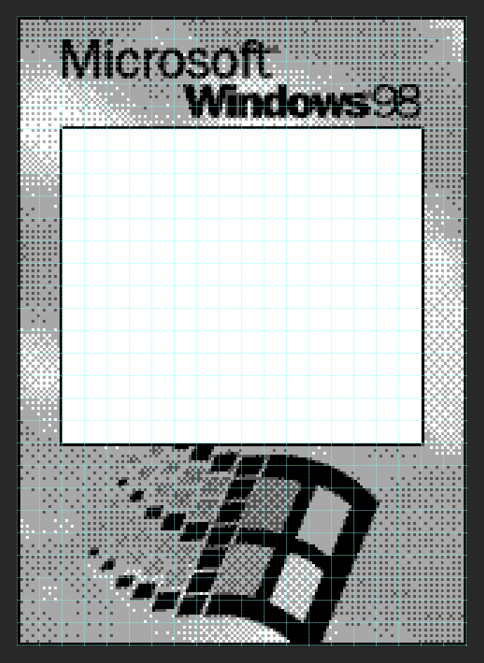

# Game Boy Camera frame injector/replacer

Python script to replace the built-in frames in the Game Boy Camera rom with your own!

## Requisites
This script requires the following Python libraries:
```yaml
python -m pip install --upgrade Pillow
python -m pip install --upgrade img2gb
```
## Usage
```yaml
usage: gbc-fr.py  [--source-image FILE]
                  [--copy-mode] [--frame-type {standard,wild}] [--source-rom FILE] [--source-frame [1-18]]
                  --target-rom FILE --target-frame [1-18]

Tool to modify frames in a Game Boy Camera rom. Inject mode is the default and can be used to  
insert an image file (.png, .bmp) or tileset (.bin). An alternative copy mode can be enabled to  
transfer frame data from one rom to another.

optional arguments:
  -h, --help #show this help message and exit

inject mode arguments:
  --source-image FILE, -si FILE #path to source image file for inject mode (.png, .bmp or already formatted tile data .bin)

copy mode arguments:
  --copy-mode, -c      #enables copy mode to rip frames from another camera rom .gb file
  --frame-type {standard,wild}, -ft {standard,wild} #select type of frame to copy from source rom, required for copy mode
  --source-rom FILE, -sr FILE #path to source rom .gb file, required for copy mode
  --source-frame [1-18], -sf [1-18] #frame number from source rom, standard:[1-18] wild:[1-8] (Hello Kitty - standard:[1-25] wild:[1-6]), required for copy mode

required arguments:
  --target-rom FILE, -tr FILE #path to target rom .gb file to be modified with changes
  --target-frame [1-18], -tf [1-18] #frame number for target rom, standard:[1-18] wild:[1-8]
```

Two modes are available inject or copy:

**Inject** is the default mode and allows using a completely new image to replace an existing frame. You can specify the source image as a .png, .bmp and it will be converted to tile data or you can provide already formatted tile data as .bin. You will also specify the target rom and target frame.

**Example**: Load supplied image into tile data and inject into the international rom, replacing frame 7.  
<pre>
python <b>./gbc-fr.py</b> <em>--source-image</em> <b>./cameraclub.png</b> <em>--target-rom</em> <b>./gameboycam-intl.gb</b> <em>--target-frame</em> <b>7</b>
</pre>

**Copy** mode pulls frame tile data from a source rom file and inserts it into the target rom. You will need to set the copy mode argument as well as specify the frame type.

**Example**: Copy wild frame 2 from JP Pocket Camera rom onto the international rom, replacing wild frame 4.  
<pre>
python <b>./gbc-fr.py</b> <em>--copy-mode</em> <em>--frame-type</em> <b>wild</b> <em>--source-rom</em> <b>./pocketcam-jp.gb</b> <em>--source-frame</em> <b>2</b> <em>--target-rom</em> <b>./gameboycam-intl.gb</b> <em>--target-frame</em> <b>4</b>
</pre>

## Designing your frame image
Game Boy Camera standard frames can only use up to 96 unique tiles but a full standard frame is made up of 136 tiles so you will need to re-use or pattern some tiles. When designing your frame, you can show a grid to be aware of how many unique tiles you've used up. The script will ignore unique tiles after hitting the 96 tile limit and will re-use the last tile for any remaining slots. The example below uses just 46 unique tiles and a re-used black tile for the rest of the frame.

*Standard frame dimensions 160px × 144px*  
<a href="#design-grid"></a>  

Wild frames don't share the same limit and can use all unique tiles across the entire image.

*Wild frame dimensions 160px × 224px*  
<a href="#wild-frame"></a>  

***Design Templates***:

[Standard frame PSD Template](samples/standard-frame-template.psd?raw=1)  
[Wild frame PSD template](samples/wild-frame-template.psd?raw=1)

## Saving your frame image
Save your image reduced down to 4 colors, this will give you a good result when converting to Game Boy tile format. **Ensure your final image has good contrast or the converted result will appear washed out and may use less than 4 shades.**  
<a href="#gameboy-palette"></a>  
<a href="#reduced-colors"></a> 

## Converting your frame image
This script uses img2gb library to convert .png and .bmp source images to tile data but if you prefer to do the conversion yourself for more control over the result, you can do so using a utility like [Pic2Tiles](http://www.budmelvin.com/dev/index.html)  
<a href="#pic2tiles"></a> 

## Purpose
Your modified ROM can be flashed onto a [Game Boy Camera Flashcart](https://github.com/HDR/Gameboy-Camera-Flashcart) to run on Game Boy hardware. Alternatively, you can load the customized rom into emulators with printer emulation like mGBA (some emulators may show a warning about incorrect checksum).

## Notes
This script will also patch your rom to expose all 8 available wild frame slots. The Japan region Pocket Camera normally only exposes 6 wild frames and the international region Game Boy Camera only exposes 7.

## Supported ROMs
This script supports the 3 standard release rom variants as a target or source file: Game Boy Camera (GBD-PCAX-0), Game Boy Camera - Zelda Limited Edition (GBD-PCBX-0), and Pocket Camera (GBD-PCAJ-1). In 2020, an unreleased Hello Kitty Pocket Camera rom variant was brought to light which stores frame data unlike the others and as such is unsupported as a target rom but is supported as a source rom using the copy function so you can copy any of its 25 standard and 6 wild frames onto one of the release rom variants.

## Credits
Thanks to @jkbenaim for their [gbcamextract](https://github.com/jkbenaim/gbcamextract) program which helped to figure out the frame data and tile map addresses.  
Thanks to @flozz for their [img2gb](https://github.com/flozz/img2gb) library which provides tile conversion for this script.  
Thanks to @Raphael-Boichot for contributing sample frame images
Thanks to @2BitPit for sample frame images
Thanks to @HDR for designing and sharing the [Game Boy Camera Flashcart PCB](https://github.com/HDR/Gameboy-Camera-Flashcart)